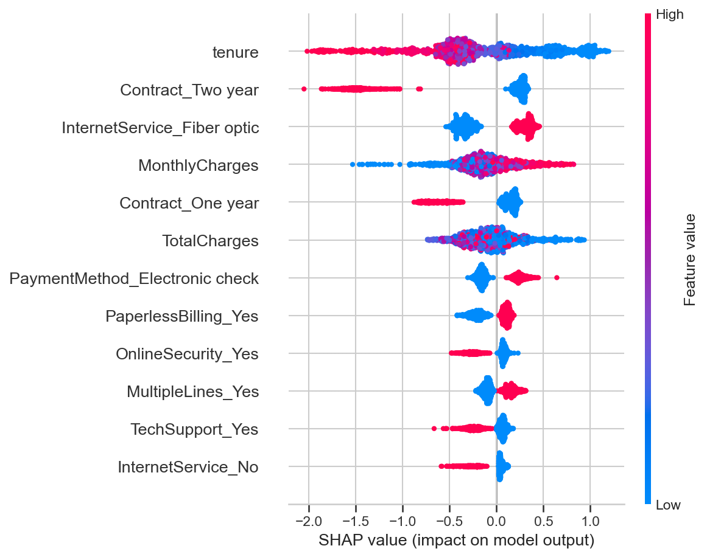
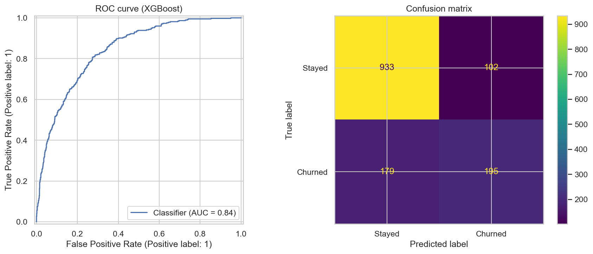

# Customer Churn Prediction (Python, SQL, XGBoost, SHAP, Streamlit, GenAI)

**Author:** Rawen Jendoubi

## Problem
A telecom company loses about 26.5% of its customers. Retaining a customer is cheaper than
winning a new one, so the goal is to predict who will leave, explain why, and recommend actions.

## Approach
1. **Data cleaning and EDA** (pandas, seaborn) on the Telco Customer Churn dataset (7,043 customers)
2. **SQL analysis** (SQLite): churn by contract, tenure group, and revenue at risk (`python/sql/`)
3. **Modeling:** XGBoost, compared with a Logistic Regression baseline and 5-fold cross-validation
4. **Explainability:** SHAP
5. **Threshold analysis:** trade-off between catching churners and false alarms
6. **Dashboard:** Streamlit app for what-if analysis per customer, with a GenAI retention message
   (Claude or OpenAI)

## Data quality
- Blank `TotalCharges` values (new customers with tenure 0) were converted to numbers and set to 0.
- `customerID` was dropped and `Churn` was encoded as 0/1.
- Categorical variables were one-hot encoded.
- The data is a single snapshot without a time dimension.

## Results
| Metric | Value |
|---|---|
| XGBoost AUC (test split) | 0.84 |
| Logistic Regression AUC (test split) | 0.842 |
| XGBoost 5-fold CV AUC | 0.842 |
| Recall / precision at threshold 0.5 | 52% / 66% |
| Recall / precision at threshold 0.3 (recommended) | 75% / 53% |

**Model choice:** a Logistic Regression baseline reaches the same AUC as XGBoost (0.842), so the
extra complexity brings no accuracy gain on this dataset. XGBoost is kept because SHAP gives
detailed per-customer explanations and it handles feature interactions, but a logistic
regression would be a reasonable, easier-to-maintain production choice.

**Threshold trade-off (test set, 1,409 customers, 374 churners):**

| Threshold | Recall | Precision | Customers flagged |
|---|---|---|---|
| 0.5 | 52% | 66% | 297 |
| 0.4 | 65% | 59% | 412 |
| **0.3** | **75%** | **53%** | **534** |
| 0.25 | 81% | 51% | 591 |

**Key drivers (SHAP):** short tenure, two-year contract (protective), fiber optic, high monthly
charges, electronic check payment.

## Business recommendations
- Move new month-to-month customers to 1-2 year contracts within their first 12 months.
- Offer tech support and automatic payment to high-risk customers.
- Use a decision threshold of 0.3 instead of 0.5: recall rises from 52% to 75% (about 85 more
  churners caught in the test set) and precision falls from 66% to 53%. Below 0.3, each extra
  flagged customer catches fewer churners. The retention team's capacity and the cost of an
  offer should decide the final value.

## Integration into existing processes
1. The model scores all customers on a regular schedule (for example weekly).
2. The high-risk list goes to the retention team, for example via the CRM.
3. The team uses the SHAP drivers and the dashboard's recommended actions to choose an offer.
4. The GenAI message is only a draft. A human reviews it before it is sent.
5. Retention results are tracked, and the model is retrained when performance drops.

## Dashboard
The Streamlit app takes a customer profile, shows the churn probability and risk level,
lists recommended actions, and drafts a retention message with an LLM.
API keys are read from a local `.env` file and are never committed.

## Run it
    pip install -r requirements.txt
    cd python
    streamlit run app/streamlit_app.py

For the GenAI feature, create `python/.env` with `ANTHROPIC_API_KEY` and/or `OPENAI_API_KEY`.

## Project structure
- `python/notebooks/`: analysis and model
- `python/sql/`: SQL queries
- `python/app/`: Streamlit dashboard
- `python/reports/figures/`: charts
- `src/main/java/`: optional Weka version in Java

## Limitations
- Single dataset, no time dimension, so the model cannot capture changes over time.
- The best threshold depends on the real cost of a retention offer and the value of a saved
  customer, which are not in the data.
- Retention success rates are unknown.
- GenAI messages need human review.

## Summary
This project predicts which telecommunications customers are likely to cancel their contracts. An XGBoost model reaches an AUC of 0.84, and a simple logistic regression does the same. SHAP shows the most important influencing factors: short contract tenure, month-to-month contracts, fiber-optic plans, and payment by electronic check. With a threshold of 0.3 instead of 0.5, 75% instead of 52% of churners are identified, at the cost of more false alarms. A Streamlit dashboard shows the risk per customer and suggests actions. An AI feature drafts a message for customer outreach, which a human reviews before it is sent.

## Tech
Python, SQL (SQLite), pandas, scikit-learn, XGBoost, SHAP, Streamlit, Claude API, OpenAI API,
Java/Maven (Weka, optional)

## Author
**Rawen Jendoubi** | GitHub: https://github.com/Rawen-24
